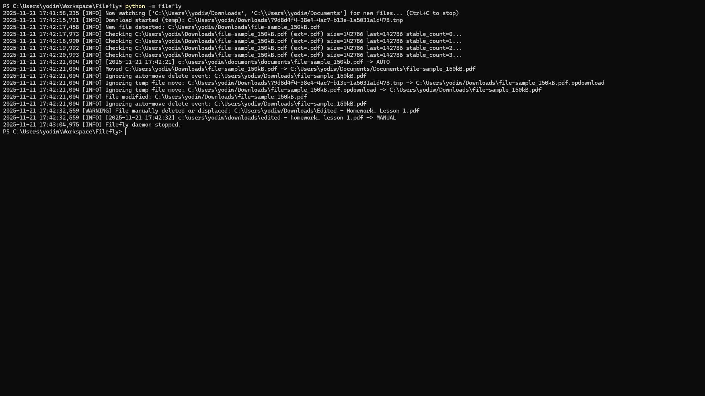

# Filefly


A real-time file automation daemon written in Python that monitors, classifies, and organizes files as they are downloaded.
Filefly combines rule-based routing with adaptive behavior to safely handle a wide range of file types.
It is designed to handle real-world edge cases such as incomplete downloads, race conditions, and conflicting file operations.

**📓 Development logs documenting the full build process are available in the `logs` branch.**
**📓 Development logs documenting the full build process are available in the `logs` branch.**

## Features
## Features

### Core Functionality
- Real-time monitoring of multiple directories
- Rule-based file routing by extension
- Automatic archive extraction (ZIP, TAR, 7z)

### Reliability
- Safe-move logic to prevent overwrites
- Download stabilization to avoid partial file handling
- Detection of manual file moves and deletions

### Observability
- Real-time `runtime_status.json`
- Persistent logging via `filefly.log`
- Lightweight web dashboard (Flask)

## Screenshots
### Core Functionality
- Real-time monitoring of multiple directories
- Rule-based file routing by extension
- Automatic archive extraction (ZIP, TAR, 7z)

### Reliability
- Safe-move logic to prevent overwrites
- Download stabilization to avoid partial file handling
- Detection of manual file moves and deletions

### Observability
- Real-time `runtime_status.json`
- Persistent logging via `filefly.log`
- Lightweight web dashboard (Flask)

## Screenshots

## Terminal


## Web Dashboard
## Web Dashboard


## Installation

**Lightweight Installation (Core Daemon)**

Installs only the core file automation system:

```
pip install filefly-files
```

Includes:
- Real-time file monitoring
- Rule-based routing
- Archive extraction
- Logging and dashboard

**Full Installation (With Analysis Tools)**

Installs Filefly with additional data analysis capabilities:

```
pip install "filefly-files[analysis]"
```

Includes everything in the core version, plus:
- File activity analytics
- Data visualization (matplotlib)
- Statistical analysis tools (pandas)
- Telemetry-based insights

### Choosing an Installation Mode
- Use _lightweight_ if you only want automated file organization
- Use _full installation_ if you want to analyze file behavior and trends over time

All Python dependencies will install automatically.

## Running Filefly

### Quick Start

```
pip install filefly-files
filefly
```

### Option 1 — Run the daemon via terminal

After installation, Filefly should provide a command-line entry point:

```
filefly
```
(Installed automatically via the CLI entry point)

This launches the background daemon and begins monitoring the configured folders.

### Option 2 — Run using Python directly

Exact equivalent to above:

```
python -m filefly
```

## Configuration

On first run, Filefly generates a configuration file:

- Linux/macOS: `~/.config/filefly/config.json`
- Local project: `filefly/config.json`

### Configuration Structure

`config.json`
```
{
    "watch_folders": ["~/Downloads"],
    "extensions": {
        ".zip": "~/Documents/Archives",
        ".pdf": "~/Documents/PDFs"
    },
    "temp_extensions": [".crdownload", ".part", ".tmp"]
}
```
Users may edit this file to customize behavior via three parameters: `watch_folders`, `extensions`, and `temp_extensions`.
- `watch_folders`: directories on the watchlist
- `extensions`: file types to reroute
- `temp_extensions`: temporary download formats to ignore

Waiting for temporary files to stabilize before processing them prevents race conditions during downloads.

In local setups, `config.json` typically lives right next to main.py.

The system can adapt to certain file behaviors over time and handle unexpected cases gracefully, using logged events to improve reliability.

File events are processed according to the rules defined in `config.json`.
If a file’s extension is recognized, it is routed to the configured destination; otherwise, it is ignored.
Filefly is designed to handle unexpected errors and edge cases gracefully.
All events and errors are recorded in `filefly.log` (in the `runtime` subfolder of the `logs` folder) for traceability and debugging.

The extension routing works as a hand-in-hand communication with main.py and config.json.
When main.py detects a downloading file of a certain extension, it's sent to config.json to see if it's recognized.
If it's not, then the file is skipped over, but if it is, then main.py will find a matching extension and take the file to the desired folder based on its extension-folder dictionary in config.json.

### Example entry:

```
{
    "watch_folders": ["~/Downloads"],
    "extensions": {
        ".zip": "~/Documents/Archives",
        ".pdf": "~/Documents/PDFs"
    },
    "temp_extensions": [".crdownload", ".part", ".tmp"]
}
```

Accidentally deleted your config file? Don't worry - Filefly automatically regenerates a new one if it runs and doesn't start off with one.

## Optional: Start Filefly at login (OS-specific)
macOS

```
brew services restart filefly
```

(or a custom plist file)

Linux (systemd)

```
systemctl --user enable filefly
systemctl --user start filefly
```

Windows

Create a Task Scheduler task pointing to:

```
python -m filefly
```

## Verify installation

To ensure Filefly is installed correctly:

```
python -c "import filefly; print(filefly.__version__)"
```

## Upgrading

```
pip install --upgrade filefly-files
```

## Upgrading

```
pip install --upgrade filefly-files
```

## Uninstalling

```
pip uninstall filefly-files
```

## How It Works

1. Filefly monitors configured directories
2. When a file appears:
   - waits for the file to stabilize
   - determines its extension
   - checks routing rules
3. If matched:
   - moves file to destination
   - extracts archives if needed
4. Logs all actions for traceability

## Future Work

Filefly is currently focused on reliable, rule-based file automation. Future development will expand its adaptability, performance, and analytical capabilities.

### Smarter Classification
- Move beyond extension-based routing toward content-aware handling
- Explore heuristic and pattern-based classification for ambiguous files
- Investigate lightweight learning approaches for recurring user behaviors

### Behavioral Analysis & Insights
- Store structured file event data using SQLite for long-term analysis
- Analyze trends in file types, sizes, and user interactions over time
- Visualize file activity patterns using matplotlib (e.g., frequency, distribution, growth)
- Use collected data to inform smarter routing and automation decisions

### Performance & Scalability
- Optimize handling of large directories with high file throughput
- Improve event processing efficiency and reduce redundant operations
- Introduce batching or prioritization strategies for heavy workloads

### Reliability Improvements
- Strengthen handling of edge cases such as interrupted writes and rapid file changes
- Expand safeguards around file conflicts and concurrent operations
- Enhance logging for deeper debugging and traceability

### Dashboard & Observability
- Expand the web dashboard with richer file event insights
- Add filtering, search, and historical views for logs
- Integrate visual analytics directly into the dashboard interface

### Extensibility
- Introduce a plugin or rule-extension system for custom behaviors
- Allow users to define more advanced routing logic beyond extensions

## Project Structure

```
Filefly/
├── assets/
│   ├── filefly_processing_vs_size.png
│   ├── filefly_terminal.png
│   └── filefly_web_dashboard.png
├── logs/
│   ├── devlogs/
│   │   ├── v0.2.0-alpha.md
│   │   ├── week1.md
│   │   ├── week2.md
│   │   ├── week3.md
│   │   ├── week4.md
│   │   └── week5.md
│   └── runtime/
│       └── filefly.log
├── src/
│   └── filefly/
│       ├── static/
│       │   ├── script.js
│       │   └── styles.css
│       ├── templates/
│       │   └── index.html
│       ├── __init__.py
│       ├── __main__.py
│       ├── app.py
│       ├── cli.py
│       ├── config.json
│       ├── filefly.db
│       ├── inspect_data.py
│       ├── logging_config.py
│       ├── main.py
│       ├── reporter.py
│       ├── runtime_status.json
│       ├── storage.py
│       └── telemetry.py
├── .gitignore
├── LICENSE
├── MANIFEST.in
├── pyproject.toml
├── README.md
└── requirements.txt
```

## Contributing and Development
Want to contribute to Filefly? Just clone this repository on your system and make any necessary changes:
## Contributing and Development
Want to contribute to Filefly? Just clone this repository on your system and make any necessary changes:

```
git clone https://github.com/YodaheWondimu/Filefly.git
cd filefly
pip install -r requirements.txt
python -m filefly
```

## License
## License
Filefly is released under the MIT License.
See `LICENSE` for more details.
