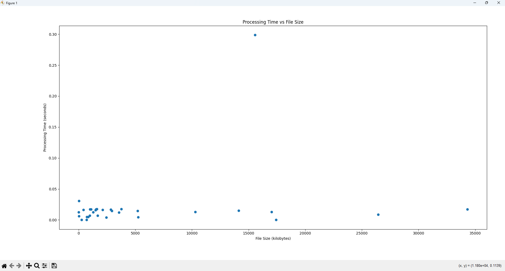

# v0.2.0-alpha.1: Integrating behavior analysis tools

This prerelease marks a structural shift in Filefly from a file automation tool to a filesystem telemetry engine.

## Summary

Version 0.1.0 focused mainly on automated sorting and basic event handling.

This was sufficient for a minimal context, but while v0.1.0 focused on making file sorting work reliably, this release introduces telemetry, measurement, and analysis, allowing Filefly to not only act on files, but also understand and evaluate its own behavior. This transforms Filefly from a background utility into a data-driven system.

The motivation behind this prerelease came from the realization that understanding filesystems could dig much deeper than surface-level File I/O.
Filesystem events provide measurable behavioral data that can be analyzed and modeled, and this presented an opportunity to explore deeper system behavior.
The goal of v0.2.0-alpha.1 is to introduce the structured collection and persistent storage of data to enable a more statistical analysis of file system activity.

## Changes

Introduced modular design:
- telemetry.py — in-memory metrics collection
- storage.py — SQLite-backed event persistence
- reporter.py — CLI-based analytics reporting connecting to storage and telemetry
- logging_config.py — Simplifies the filefly.log setup to normalize its path across directories
- - This allows for one log folder in the root directory, but different kinds of logs inside said folder (human-written devlogs like this one, and Filefly-written runtime logs)
- - In other words, the logs folder now has two subfolders: devlogs (human), and runtime (Filefly)
- Separated event capture from data modeling.
- Implemented structured event schema for research-grade logging.

Stabilization Benchmarking got some updates too:
- Added timing instrumentation to capture a couple more data points:
- - Time-to-stable for new files
- - Correlation between file size and stabilization delay

On top of this newfound modularity, I integrated a SQLite storage layer into this release for further benchmarking.
This schema includes:
- file path
- event type
- extension
- file size
- stabilization time
- UTC timestamp
With file events classified when they happen:
- created
- sorted
- archive_extracted

I managed to implement a data analysis pipeline for this collected data through visualizations + insights from matplotlib + pandas.
This meant:
- file type distribution graphs
- stabilization time histograms
- processing time vs file size analysis
- event timelines

The identities behind each file got reformed for stability later down the line.
I managed to take Filefly from path-based tracking to time + size-aware tracking, which helps eliminate duplicate suppression bugs and redownload conflicts.

## Potential Research

This release enables future study of:
- File extension frequency distribution
- Download stabilization latency
- Event burst patterns
- Manual vs automated file operations (with improved accuracy)

These topics are just some of which I've started to learn more about (more on that below).

## Processing Time vs File Size

## What needs work

These problems show me what I can work on next, but the daemon in itself is still functional despite the early stages of development presenting its challenges.

1. Stabilization Time vs File Size
Stabilization times across processed files was usually system-dominated for a surprisingly large fraction of files.
Across files ranging from a few KB to ~35 MB, average stabilization time ≈ 2.8 seconds.
This average results from a mix of non-image files (~3s stabilization) and image files (~1.5s), though these values are largely artifacts of Filefly’s fixed stable_count logic rather than true file behavior.
Stabilization latency is currently driven by Filefly’s polling logic (stable_count of 3 seconds for most files), not actual file size or disk I/O.
One promising solution is to change this stabilization time per file from heavily enforced to carefully measured.

2. Weak correlation between File Size and Processing Time
Larger files didn't increase significantly in stabilization duration.
Smaller files didn't adapt their stabilization time to fit their size, either.
Thresholds that adapt to file size through differing stabilization times would be a great solution for this issue.

3. Small file inefficiency
When files are very small, such as a .txt file that is less than 1KB in size, multi-second delays are still met, even when the file is already stable in nature.
Current file handling logic seems regressive for small files, so future core logic edits should take this into account.

4. Real-world outliers found
Occasional files take significantly longer to stabilize, with likely causes including:
- OS-level file locks
- Antivirus scanning
- Browser post-write operations
What validates the need for more robust handling is the fact that file systems in the real world have non-deterministic delays.
In other words, real-world usage brings its own factors outside of Filefly's control that may affect performance, and preparing for these ensures long-term stability.

## Next Steps (v0.2.0-beta)
- Extension-level statistics
- Performance benchmarking tools
- Anomaly detection heuristics
- CSV/JSON export
- Configurable monitoring parameters

I honestly can't wait to discover what the rest of this shift will bring to Filefly.

God bless you,

^ Yodahe